# Привет! 👋 Я e24x5

Создаю приложения и инструменты с помощью **Claude Code** и нейросетей.

  

---

<picture>
  <source media="(prefers-color-scheme: dark)" srcset="./fox-snake-dark.svg">
  <source media="(prefers-color-scheme: light)" srcset="./fox-snake.svg">
  
</picture>
