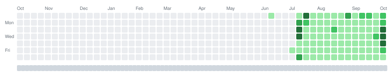

# Привет! 👋 Я e24x5

Создаю приложения и инструменты с помощью **Claude Code** и нейросетей.
Главный проект — [русификаторы игр](https://e24x5-fox.github.io/claude-rus-hub/).

  <b>Языки</b> 
  

  <b>Платформы и инструменты</b> 
  

  <b>Игровые движки</b> 
   
  
  

  <b>Нейросети и графика</b> 
   
  
  

---

<picture>
  <source media="(prefers-color-scheme: dark)" srcset="./fox-snake-dark.svg">
  <source media="(prefers-color-scheme: light)" srcset="./fox-snake.svg">
  
</picture>
